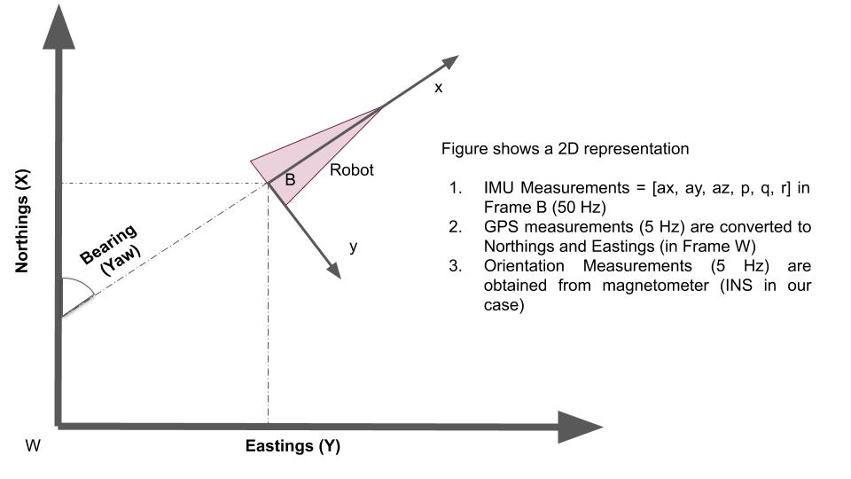

# Extended Kalman Filter for Fusing IMU, GPS and Bearing data
This package contains an EKF implementation for fusing information coming from an IMU (50 Hz) and GPS (5 Hz). The IMU provides the body acceleration and the body rotation rates. The GPS unit provides Latitude, Longitude, Altitude and absolute Orientation in NED cooridnate frame. The estimator estimates the robot's 3D pose and linear velocities. Hence, the state size is 9.

## Setup
MATLAB is required. 

## Prediction
We use the IMU to predict and propagate the 3D pose of the robot. The IMU measurements are fed into a [motion model](https://github.com/amirx96/golfcart-gps-odom-ekf/blob/master/matlab-analysis/motion_model.m) for prediction of both the state and it's uncertainty. We assume all the uncertainty in the IMU's measuments are encoded in a process noise covariance matrix Q.

## Running the code
Open the file named [stateEstimation3D.m](https://github.com/amirx96/golfcart-gps-odom-ekf/blob/master/matlab-analysis/stateEstimation3D.m) and hit Run. 
